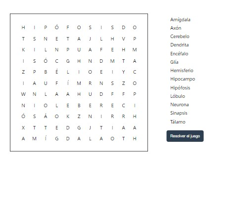

# Juego de Sopa de Letras

 

   

## Características

- Interfaz interactiva y fácil de usar.
- Resaltado de palabras encontradas.
- Opción para resolver el juego.

## Tecnologías Utilizadas

- **HTML**: Para la estructura del juego.
- **CSS**: Para el diseño y estilo visual.
- **JavaScript**: Para la lógica del juego y la interacción.

## Instalación

Para jugar, simplemente clona este repositorio en tu computadora y abre el archivo index.html en tu navegador.

## Cómo Jugar

1. Abre el juego en tu navegador.
2. Busca y selecciona las palabras ocultas en la cuadrícula.
3. Las palabras encontradas se resaltarán.

## Contribuciones

Las contribuciones son bienvenidas. Si deseas mejorar este juego, siéntete libre de hacer un fork del repositorio y enviar un pull request.

¡Diviértete jugando!
